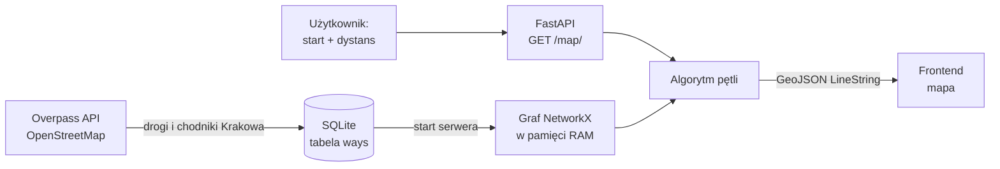

# 🚶 &lt;PrzeSpaceruj Kraków&gt;

### Powiedz, ile chcesz przejść — my wyznaczymy najprzyjemniejszą pętlę spod Twoich drzwi.

**HackYeah 2026 · kategoria SPORT & HEALTHCARE**

<!-- TODO: wrzucić nagranie/screen z frontendu do docs/demo.gif -->
<!--  -->

---

## 🩺 Problem

Wiemy, że powinniśmy się więcej ruszać — WHO zaleca dorosłym co najmniej 150 minut umiarkowanej aktywności tygodniowo, a najprostszą formą takiej aktywności jest zwykły spacer. Mimo to większość z nas nie wychodzi z domu „po prostu na spacer”, bo:

- **nie mamy celu** — aplikacje nawigacyjne pytają _„dokąd?”_, a my chcemy tylko _„przejść 3 km”_,
- **chodzimy w kółko tą samą trasą** i po tygodniu robi się nudno,
- **najkrótsza droga to rzadko najprzyjemniejsza** — ruchliwa ulica zamiast parku czy deptaka.

## 💡 Rozwiązanie

**&lt;PrzeSpaceruj Kraków&gt;** odwraca pytanie nawigacji. Zamiast celu podajesz **punkt startowy i dystans**, a dostajesz:

- 🔁 **pętlę** — wracasz dokładnie tam, skąd wyszedłeś, bez dreptania tą samą drogą w obie strony,
- 📏 **o zadanej długości** — 2 km na przerwę w pracy, 5 km na wieczór, 10 km na weekend,
- 🌳 **po najprzyjemniejszych ulicach** — każdy odcinek ma ocenę, a algorytm woli te lepiej ocenione,
- 🎲 **za każdym razem inną** — losowy kierunek i szum w wagach sprawiają, że codzienny spacer nie jest rutyną,
- 🏙️ **w całym Krakowie** — graf obejmuje całe miasto, nie tylko centrum.

## 📊 W liczbach

|                                            |                |
| ------------------------------------------ | -------------- |
| Odcinki dróg (OSM ways)                    | **72 668**     |
| Łączna długość sieci                       | **~3 326 km**  |
| Węzły grafu (każdy wierzchołek odcinka)    | **194 625**    |
| Wczytanie grafu do RAM (raz, przy starcie) | **~1,8 s**     |
| Wygenerowanie pętli                        | **~80–120 ms** |

Pomiary lokalne: `RoutingEngine` na `hackathon_map.db`, start: Rynek Główny, dystanse 2/3/5 km.

---

## ⚙️ Jak to działa

### 1. Dane

Drogi pobieramy z **Overpass API** (OpenStreetMap) — typy `primary`, `secondary`, `tertiary`, `footway`, `pedestrian` w granicach administracyjnych Krakowa. Skrypt ma listę 7 mirrorów Overpassa i przełącza się na kolejny, gdy któryś nie odpowiada. Długość każdego odcinka liczymy geodezyjnie, a całość trafia do tabeli `ways` (`way_id`, `coordinates`, `distance`, `way_rating`, `ratings_count`).

Oceny są w skali **1–10**: `way_rating` to **średnia** ocen odcinka, a `ratings_count` to liczba ocen, z których ją policzono (`0` = brak ocen, wtedy `way_rating` = 5,0). Nową ocenę $g$ dolicza się jako `way_rating = (way_rating·n + g) / (n + 1)`. Kolumny dodaje (idempotentnie) `uv run python init_db.py`.

### 2. Graf z „kosztem przyjemności”

Przy starcie serwera `RoutingEngine` wczytuje wszystkie odcinki do nieskierowanego grafu NetworkX — **raz**, z węzłem w każdym wierzchołku drogi (drogi w OSM łączą się też w środku, nie tylko na końcach) i tylko z największą spójną składową, dzięki czemu każde zapytanie użytkownika to tylko obliczenia w pamięci. Waga krawędzi to nie sama długość, a **koszt spaceru**:

$$
\text{koszt} = d \cdot (11 - r), \qquad w = \text{koszt} \cdot \varepsilon, \quad \varepsilon \sim U(0.9,\ 1.1)
$$

gdzie $d$ to długość odcinka w metrach, a $r$ to jego średnia ocena (1–10, `MAX_GRADE = 11`). Trasy A→B używają dokładnego `koszt`, a pętle zaszumionego $w$. Ulica oceniona wysoko jest dla algorytmu „tańsza”, więc chętniej nią poprowadzi trasę — nawet jeśli to kawałek dłużej. Szum $\varepsilon$ sprawia, że remisy rozstrzygają się za każdym razem inaczej.

### 3. Trasa A→B (`find_route`)

Start i cel dociągamy do najbliższych węzłów, a potem A\* szuka ścieżki o **najniższym koszcie** $\sum d \cdot (11 - r)$, a nie najkrótszej. Heurystyka (odległość w linii prostej) nigdy nie przeszacowuje, bo najtańszy odcinek kosztuje $d \cdot 1$, więc wynik jest optymalny. Wynik to GeoJSON `Feature` z `length_m`, `cost`, `way_ids` i `shortest_length_m` (dla porównania). Zwraca go `POST /generate/` w trybie `two_points`.

### 4. Algorytm pętli (`generate_loop`)

1. **Korekta na krętość miasta.** Trasa po ulicach jest średnio ~1,3× dłuższa niż w linii prostej (_detour index_), więc żądany dystans dzielimy przez 1,3, żeby realnie przejść tyle, ile użytkownik chciał.
2. **Losowy punkt zwrotny.** Losujemy kierunek 0–360° i wzorem na odległość po kole wielkim wyznaczamy punkt w połowie tego dystansu.
3. **Przyciąganie do sieci.** Start i punkt zwrotny dociągamy do najbliższych węzłów grafu — odległości liczymy z poprawką `cos(szerokości)`, bo stopień długości geograficznej w Krakowie jest wyraźnie krótszy od stopnia szerokości.
4. **Droga „tam”.** Najtańsza ścieżka (Dijkstra) od startu do punktu zwrotnego.
5. **Kara za powtórki.** Każdą krawędź użytą w drodze „tam” tymczasowo **mnożymy ×100**, żeby powrót wybrał inne ulice.
6. **Droga „z powrotem”.** Znowu najtańsza ścieżka — tym razem omijająca już przebyty odcinek. Potem przywracamy oryginalne wagi, żeby kolejne zapytania nie były zaburzone.
7. **Sklejanie geometrii.** Łączymy pełną geometrię odcinków w jeden `LineString`. W grafie nieskierowanym odcinek może być zapisany „odwrotnie”, więc w razie potrzeby odwracamy jego punkty (bez tego trasa na mapie robi zygzaki) i usuwamy zdublowane punkty na skrzyżowaniach.

Wynik to gotowy **GeoJSON**, który frontend rysuje na mapie bez żadnej obróbki.

---

## 👥 Zespół

- Kamil Kręcigłowa
- Adrian Gamracy
- Paweł Kowalski
- Mikołaj Zaśko
- Rafał Wąsek

## 📄 Dane i licencja

Dane mapowe © [OpenStreetMap contributors](https://www.openstreetmap.org/copyright), dostępne na licencji [ODbL](https://opendatacommons.org/licenses/odbl/).

Zbudowane na HackYeah 2026 w Krakowie 💚

