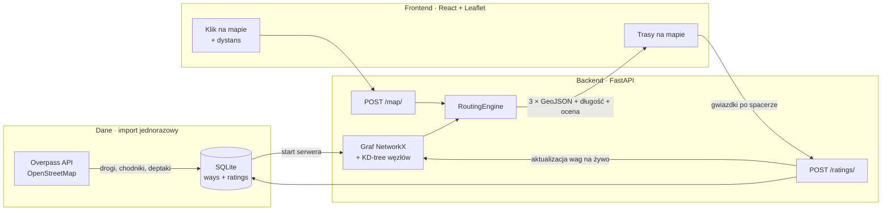
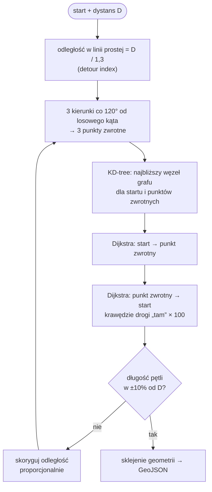

<div align="center">

<!-- TODO: zrzut ekranu aplikacji albo slajd tytułowy z prezentacji -->
<!--  — pętla spacerowa na mapie Krakowa" width="900"/> -->

# 🚶 &lt;NAZWA_PROJEKTU&gt;

### Powiedz, ile chcesz przejść — my wyznaczymy najprzyjemniejszą pętlę spod Twoich drzwi.

**HackYeah 2026 · SPORT & HEALTHCARE · zadanie: &lt;NAZWA_ZADANIA&gt;**

[🎬 Demo](<LINK_DO_DEMO>) · [📊 Prezentacja](<LINK_DO_PREZENTACJI>) · [🎨 Figma](<LINK_DO_FIGMY>) · [🌐 Wersja live](<LINK_DO_APLIKACJI>)


</div>

---

> **TL;DR** — Klikasz na mapie, wpisujesz „3 km” i w ~0,1 s dostajesz trzy różne pętle spacerowe po Krakowie, które wracają pod Twoje drzwi i prowadzą przez parki i deptaki zamiast wzdłuż ruchliwych arterii. Po spacerze oceniasz ulice — i następna trasa jest jeszcze lepsza. Dla Ciebie i dla każdego, kto pójdzie po Tobie.

## 🩺 Problem

[WHO zaleca](https://www.who.int/news-room/fact-sheets/detail/physical-activity) dorosłym co najmniej **150 minut umiarkowanej aktywności fizycznej tygodniowo**. Najtańszą, najbezpieczniejszą i najbardziej dostępną formą takiej aktywności jest zwykły spacer — a mimo to rzadko wychodzimy „po prostu się przejść”:

- **🧭 Brak celu.** Każda aplikacja nawigacyjna zaczyna od pytania *„dokąd?”*. A my nie chcemy nigdzie dojść — chcemy przejść 3 km i wrócić.
- **🔁 Rutyna.** Chodzimy w kółko tą samą trasą, po tygodniu robi się nudno i rezygnujemy.
- **🚗 Najkrótsza ≠ najprzyjemniejsza.** Nawigacja prowadzi wzdłuż ruchliwych ulic, a park jest dwie przecznice obok.

## 💡 Rozwiązanie

**&lt;NAZWA_PROJEKTU&gt;** odwraca pytanie nawigacji: zamiast *„dokąd?”* pyta *„ile?”*.

### Jak to działa dla użytkownika — 3 kroki

1. **Kliknij na mapie** punkt startowy (dom, biuro, przystanek).
2. **Wpisz dystans** — 2 km na przerwę w pracy, 5 km na wieczór, 10 km na weekend.
3. **Wybierz jedną z trzech pętli** i ruszaj. Po powrocie oceń trasę gwiazdkami.

### Funkcje

| | Funkcja | Opis |
|---|---|---|
| 🔁 | **Pętle o zadanej długości** | Wracasz tam, skąd wyszedłeś; powrót prowadzi innymi ulicami niż droga „tam”, a długość trasy jest kalibrowana do żądanej |
| 🎲 | **3 warianty naraz** | Trzy pętle w trzech różnych kierunkach — codziennie inny spacer |
| 📍 | **Tryb A→B „naokoło”** | Do celu nie najkrótszą, tylko najprzyjemniejszą drogą — z limitem nadłożenia |
| 🌳 | **Trasy po przyjemnych ulicach** | Każdy odcinek ma ocenę: z danych OSM (deptak, park, ścieżka) i od społeczności |
| ⭐ | **Oceny społeczności** | Po spacerze oceniasz trasę, a oceny od razu wpływają na kolejne trasy |
| 🏙️ | **Cały Kraków** | 72 668 odcinków, ~3 326 km sieci — od Nowej Huty po Bielany |
| ⚡ | **Natychmiastowa odpowiedź** | Graf siedzi w pamięci; pętla wyznacza się w ~0,1 s |

---

## 🏗️ Architektura



Trzy warstwy, jeden kierunek przepływu: **dane** z OpenStreetMap trafiają raz do SQLite, **silnik trasowania** trzyma całe miasto w pamięci jako graf, a **mapa** w przeglądarce pokazuje trasy i zbiera oceny — które wracają do grafu i zamykają pętlę uczenia.

---

## 🧠 Silnik trasowania

Serce projektu to [`routing.py`](routing.py), klasa `RoutingEngine`. Poniżej cała droga od surowych danych OSM do trasy na mapie.

### 1. Topologia: od odcinków do grafu pieszego

Dane z OSM to łamane (`ways`) — ulica może przecinać inne ulice w środku swojej geometrii, nie tylko na końcach. Dlatego przy budowie grafu:

1. **Dzielimy odcinki na skrzyżowaniach.** Każdy punkt współdzielony przez dwa lub więcej odcinków staje się węzłem grafu, a odcinek jest cięty na krawędzie między kolejnymi skrzyżowaniami. Dzięki temu można skręcić w każdą przecznicę, a nie tylko na końcu ulicy.
2. **Sklejamy bliskie punkty.** Węzły identyfikujemy po współrzędnych zaokrąglonych do 4 miejsc po przecinku (≈ 11 m × 7 m na szerokości Krakowa) — końce chodników narysowanych w OSM „prawie” w tym samym miejscu łączą się w jedno skrzyżowanie.
3. **Zostawiamy największą spójną składową.** Odcinki odcięte od reszty sieci (np. ścieżka na zamkniętym terenie) są odrzucane, więc z każdego punktu startowego da się wyznaczyć pętlę.
4. **Graf jest nieskierowany** — pieszy może iść w obie strony każdej ulicy — a pełna geometria każdej krawędzi jest zapisana na krawędzi i odtwarzana dopiero przy budowaniu odpowiedzi.

### 2. Koszt spaceru zamiast długości

Algorytm nie minimalizuje metrów, tylko **koszt spaceru** — długość ważoną oceną odcinka:

$$
w = d \cdot (6 - r) \cdot \varepsilon, \qquad r \in [1, 5], \quad \varepsilon \sim U(0.9,\ 1.1)
$$

| Symbol | Znaczenie |
|---|---|
| $d$ | długość krawędzi w metrach (liczona geodezyjnie) |
| $r$ | ocena odcinka w skali 1–5 ★ |
| $\varepsilon$ | niewielki szum rozbijający remisy między równorzędnymi ulicami |

Odcinek na 5 ★ kosztuje **1×** swoją długość, a na 1 ★ — aż **5×**. Algorytm chętnie nadłoży więc 200 m, żeby przejść Plantami zamiast wzdłuż Alei Trzech Wieszczów.

### 3. Skąd biorą się oceny

Ocena odcinka łączy dwa źródła:

- **Ocena bazowa z OSM** — wynika z typu drogi: `pedestrian`, `footway`, `path` w parku dostają wysoką ocenę, `primary` i `secondary` wzdłuż ruchu samochodowego — niską. Dzięki temu aplikacja ma sens od pierwszego uruchomienia, zanim ktokolwiek cokolwiek oceni.
- **Oceny społeczności** — po spacerze użytkownik ocenia trasę, a ocena trafia do wszystkich jej odcinków.

Oba źródła łączymy **średnią bayesowską**, żeby jedna skrajna ocena nie przestawiała całej ulicy:

$$
r = \frac{C \cdot r_{\text{OSM}} + \sum r_i}{C + n}
$$

gdzie $n$ to liczba ocen społeczności, a $C$ to „waga” oceny bazowej (ile głosów jest warta). Nowa ocena od razu aktualizuje wagi krawędzi w pamięci — bez restartu serwera.

### 4. Algorytm pętli



1. **Korekta na krętość miasta.** Trasa po ulicach jest średnio ~1,3× dłuższa niż w linii prostej (*detour index*), więc punkt zwrotny wyznaczamy w odległości `D / 1,3 / 2` od startu.
2. **Trzy kierunki naraz.** Losujemy kąt startowy i dokładamy dwa kolejne co 120° — trzy punkty zwrotne w trzech różnych częściach okolicy, a więc trzy naprawdę różne pętle. Punkty liczymy wzorem na odległość po kole wielkim.
3. **Przyciąganie do sieci.** Najbliższy węzeł grafu znajdujemy w **KD-tree** zbudowanym na współrzędnych przeskalowanych o `cos(szerokości)` — w Krakowie stopień długości geograficznej to tylko ~64% stopnia szerokości, więc bez tej poprawki „najbliższy” węzeł byłby źle wybrany. Zapytanie kosztuje O(log V) zamiast przeglądania wszystkich węzłów.
4. **Droga „tam”** — Dijkstra po kosztach spaceru.
5. **Droga „z powrotem” z karą za powtórki.** Krawędzie użyte w drodze „tam” są dla powrotu **100× droższe**. To miękkie ograniczenie, a nie zakaz: powrót omija przebyte ulice, jeśli ma jakąkolwiek rozsądną alternatywę, ale wciąż może ich użyć tam, gdzie innej drogi nie ma (most, kładka, ślepa uliczka). Twarde usunięcie krawędzi w takich miejscach w ogóle uniemożliwiłoby pętlę.
   Kara jest liczona w **funkcji wagi przekazanej do Dijkstry dla danego zapytania** — współdzielony graf nigdy nie jest modyfikowany, więc równoległe zapytania wielu użytkowników nie wchodzą sobie w drogę.
6. **Kalibracja długości.** Jeśli wynikowa pętla odbiega od żądanego dystansu o więcej niż 10%, korygujemy odległość punktu zwrotnego proporcjonalnie do błędu i liczymy jeszcze raz. Zwykle wystarcza jedna poprawka.
7. **Sklejanie geometrii.** Łączymy pełne geometrie kolejnych krawędzi w jeden `LineString`:
   - w grafie nieskierowanym krawędź u→v mogła zostać zapisana jako v→u — jeśli pierwszy punkt geometrii nie zgadza się z węzłem `u`, odwracamy kolejność punktów (inaczej trasa na mapie robi zygzaki),
   - pierwszy punkt każdej kolejnej krawędzi pomijamy, bo pokrywa się z ostatnim punktem poprzedniej.

### 5. Tryb A→B „naokoło”

Ten sam koszt spaceru, jedna Dijkstra od startu do celu — ale z **limitem nadłożenia**: jeśli najprzyjemniejsza trasa jest dłuższa niż 1,5× trasa najkrótsza, stopniowo zmniejszamy wpływ ocen, aż trasa zmieści się w limicie. Idziesz ładniej, ale nie dwa razy dłużej.

### 6. Wydajność

| Krok | Złożoność | Kiedy |
|---|---|---|
| Budowa grafu i KD-tree | O(E + V log V) | raz, przy starcie serwera (~2 s) |
| Przyciągnięcie punktu do sieci | O(log V) | każde zapytanie |
| Dijkstra × 2 na pętlę | O(E log V) | każde zapytanie |
| Sklejenie geometrii | O(długość trasy) | każde zapytanie |

Kluczowa decyzja: graf całego miasta budujemy **raz**, przy starcie serwera — pojedyncze zapytanie to już tylko obliczenia w pamięci, ~0,1 s na pętlę.

---

## 🗺️ Frontend

**React 19 + TypeScript + Vite**, mapa na **react-leaflet** z kafelkami OpenStreetMap.

- 🎯 **Point & Distance** — klik ustawia start, suwak/pole ustawia dystans, a niebieskie koło pokazuje zasięg spaceru.
- 📍 **2 Points** — start (zielony znacznik) i cel (czerwony) dla trybu A→B.
- 🗺️ **Trzy trasy na mapie** w różnych kolorach, z długością i średnią oceną — klik w trasę wybiera ją i dopasowuje widok mapy.
- ⭐ **Ocena po spacerze** — gwiazdki pod wybraną trasą, wysyłane do `POST /ratings/`.

---

## 📊 W liczbach

| | |
|---|---|
| Odcinki dróg z OpenStreetMap | **72 668** |
| Łączna długość sieci pieszej | **~3 326 km** |
| Zasięg | **cały Kraków** — wszystkie 18 dzielnic |
| Start serwera (wczytanie grafu) | **~2 s** |
| Wyznaczenie pętli | **~0,1 s** |

---

## 🚀 Szybki start

### Jedną komendą

```bash
docker compose up
```

Aplikacja: <http://localhost:5173> · API i dokumentacja Swagger: <http://localhost:8000/docs>

### Lokalnie, do developmentu

Wymagania: [uv](https://docs.astral.sh/uv/) (sam zainstaluje Pythona 3.14) i Node.js.

```bash
# backend
uv sync
uv run fastapi dev                 # http://localhost:8000

# frontend (w drugim terminalu)
cd frontend
npm install
npm run dev                        # http://localhost:5173
```

### Sam silnik, bez serwera

```bash
uv run python test_routing.py      # zapisuje pętlę do test_route.geojson
```

Plik można wkleić na [geojson.io](https://geojson.io) i obejrzeć trasę na mapie.

---

## 📡 API

| Metoda | Endpoint | Opis |
|---|---|---|
| `POST` | `/map/` | Wyznacza trasy: pętle (`point_distance`) albo A→B (`two_points`) |
| `POST` | `/ratings/` | Zapisuje ocenę trasy (1–5 ★) i od razu aktualizuje wagi w grafie |
| `POST` | `/admin/reload-graph/` | Przeładowuje graf z bazy (np. po imporcie nowych danych OSM); wymaga tokenu |

**Pętla 3 km z Rynku Głównego:**

```bash
curl -X POST http://localhost:8000/map/ \
  -H "Content-Type: application/json" \
  -d '{"mode": "point_distance", "point": {"lat": 50.0614, "lng": 19.9383}, "distanceKm": 3}'
```

```json
{
  "status": "success",
  "routes": [
    {
      "geometry": { "type": "LineString", "coordinates": [[19.9383, 50.0613], [19.9379, 50.0614], "..."] },
      "length_m": 3045,
      "avg_rating": 4.2
    },
    { "...": "druga pętla" },
    { "...": "trzecia pętla" }
  ]
}
```

**Spacer A→B:**

```json
{ "mode": "two_points", "start": {"lat": 50.0614, "lng": 19.9383}, "destination": {"lat": 50.0540, "lng": 19.9354} }
```

---

## 🗂️ Struktura projektu

```
.
├── main.py                 # FastAPI: endpointy, CORS, graf ładowany przy starcie
├── routing.py              # ⭐ RoutingEngine: topologia, koszty, pętle, A→B, GeoJSON
├── database_setup.py       # import dróg Krakowa z Overpass API do SQLite
├── init_db.py              # schemat bazy: odcinki i oceny
├── test_routing.py         # test end-to-end silnika → test_route.geojson
├── hackathon_map.db        # SQLite z siecią dróg Krakowa
├── docker-compose.yml      # backend + frontend jedną komendą
├── pyproject.toml          # zależności Pythona (uv)
└── frontend/
    ├── src/
    │   ├── App.tsx         # tryby, formularz, zapytania do API, wybór trasy
    │   ├── components/
    │   │   └── Map.tsx     # mapa Leaflet, znaczniki, koło zasięgu, trasy
    │   └── types/map.ts    # typy współrzędnych, zapytań i odpowiedzi
    ├── package.json
    └── vite.config.ts
```

---

## 🌍 Wpływ i skalowalność

- **Zdrowie publiczne bez barier** — nie potrzeba opaski, karnetu ani sprzętu; wystarczy telefon i 30 minut.
- **Każde miasto z OpenStreetMap** — import danych to jedno zapytanie do Overpass z nazwą miasta; silnik nie ma nic „zaszytego” pod Kraków.
- **Dane, które rosną z każdym spacerem** — oceny społeczności budują mapę przyjemności miasta, przydatną także dla urbanistów: które ulice mieszkańcy omijają i dlaczego.

## 🛣️ Co dalej

- 🌳 **Automatyczne oceny z danych przestrzennych** — bliskość zieleni i wody, natężenie ruchu, oświetlenie po zmroku
- ❤️ **Integracja z Google Fit / Apple Health** — dzienny cel w krokach lub minutach zamiast w kilometrach
- ♿ **Profile dostępności** — trasy bez schodów i z niskimi krawężnikami dla wózków i rodziców z dziećmi
- 👥 **Spacery grupowe** — wspólna pętla dla kilku osób startujących z różnych miejsc

---

## 👥 Zespół

| Osoba | Rola | GitHub |
|---|---|---|
| &lt;Imię Nazwisko&gt; | &lt;rola&gt; | [@&lt;login&gt;](https://github.com/) |
| &lt;Imię Nazwisko&gt; | &lt;rola&gt; | [@&lt;login&gt;](https://github.com/) |
| &lt;Imię Nazwisko&gt; | &lt;rola&gt; | [@&lt;login&gt;](https://github.com/) |
| &lt;Imię Nazwisko&gt; | &lt;rola&gt; | [@&lt;login&gt;](https://github.com/) |
| &lt;Imię Nazwisko&gt; | &lt;rola&gt; | [@&lt;login&gt;](https://github.com/) |

## 📚 Źródła

- WHO — [Physical activity: fact sheet](https://www.who.int/news-room/fact-sheets/detail/physical-activity) (zalecenia aktywności dla dorosłych)
- Dane mapowe © [OpenStreetMap contributors](https://www.openstreetmap.org/copyright), licencja [ODbL](https://opendatacommons.org/licenses/odbl/)
- [NetworkX](https://networkx.org/) — algorytmy grafowe, [Overpass API](https://overpass-api.de/) — pobieranie danych OSM

<div align="center">
<sub>Zbudowane na HackYeah 2026 w Krakowie 💚</sub>
</div>
