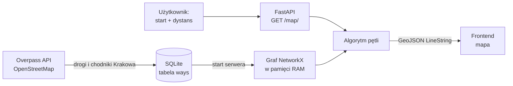

<div align="center">

# 🚶 &lt;NAZWA_PROJEKTU&gt;

### Powiedz, ile chcesz przejść — my wyznaczymy najprzyjemniejszą pętlę spod Twoich drzwi.

**HackYeah 2026 · kategoria SPORT & HEALTHCARE**


<!-- TODO: wrzucić nagranie/screen z frontendu do docs/demo.gif -->
<!--  -->

</div>

---

## 🩺 Problem

Wiemy, że powinniśmy się więcej ruszać — WHO zaleca dorosłym co najmniej 150 minut umiarkowanej aktywności tygodniowo, a najprostszą formą takiej aktywności jest zwykły spacer. Mimo to większość z nas nie wychodzi z domu „po prostu na spacer”, bo:

- **nie mamy celu** — aplikacje nawigacyjne pytają *„dokąd?”*, a my chcemy tylko *„przejść 3 km”*,
- **chodzimy w kółko tą samą trasą** i po tygodniu robi się nudno,
- **najkrótsza droga to rzadko najprzyjemniejsza** — ruchliwa ulica zamiast parku czy deptaka.

## 💡 Rozwiązanie

**&lt;NAZWA_PROJEKTU&gt;** odwraca pytanie nawigacji. Zamiast celu podajesz **punkt startowy i dystans**, a dostajesz:

- 🔁 **pętlę** — wracasz dokładnie tam, skąd wyszedłeś, bez dreptania tą samą drogą w obie strony,
- 📏 **o zadanej długości** — 2 km na przerwę w pracy, 5 km na wieczór, 10 km na weekend,
- 🌳 **po najprzyjemniejszych ulicach** — każdy odcinek ma ocenę, a algorytm woli te lepiej ocenione,
- 🎲 **za każdym razem inną** — losowy kierunek i szum w wagach sprawiają, że codzienny spacer nie jest rutyną,
- 🏙️ **w całym Krakowie** — graf obejmuje całe miasto, nie tylko centrum.

## 📊 W liczbach

| | |
|---|---|
| Odcinki dróg (OSM ways) | **72 668** |
| Łączna długość sieci | **~3 326 km** |
| Węzły grafu | **82 282** |
| Wczytanie grafu do RAM (raz, przy starcie) | **~1,8 s** |
| Wygenerowanie pętli | **~80–120 ms** |

<sub>Pomiary lokalne: `RoutingEngine` na `hackathon_map.db`, start: Rynek Główny, dystanse 2/3/5 km.</sub>

---

## ⚙️ Jak to działa



### 1. Dane
Drogi pobieramy z **Overpass API** (OpenStreetMap) — typy `primary`, `secondary`, `tertiary`, `footway`, `pedestrian` w granicach administracyjnych Krakowa. Skrypt ma listę 7 mirrorów Overpassa i przełącza się na kolejny, gdy któryś nie odpowiada. Długość każdego odcinka liczymy geodezyjnie, a całość trafia do tabeli `ways` (`way_id`, `coordinates`, `distance`, `way_rating`).

### 2. Graf z „kosztem przyjemności”
Przy starcie serwera `RoutingEngine` wczytuje wszystkie odcinki do nieskierowanego grafu NetworkX — **raz**, dzięki czemu każde zapytanie użytkownika to tylko obliczenia w pamięci. Waga krawędzi to nie sama długość, a **koszt spaceru**:

$$
w = d \cdot (11 - r) \cdot \varepsilon, \qquad \varepsilon \sim U(0.9,\ 1.1)
$$

gdzie $d$ to długość odcinka w metrach, a $r$ to jego ocena. Ulica oceniona wysoko jest dla algorytmu „tańsza”, więc chętniej nią poprowadzi trasę — nawet jeśli to kawałek dłużej. Szum $\varepsilon$ sprawia, że remisy rozstrzygają się za każdym razem inaczej.

### 3. Algorytm pętli (`generate_loop`)

1. **Korekta na krętość miasta.** Trasa po ulicach jest średnio ~1,3× dłuższa niż w linii prostej (*detour index*), więc żądany dystans dzielimy przez 1,3, żeby realnie przejść tyle, ile użytkownik chciał.
2. **Losowy punkt zwrotny.** Losujemy kierunek 0–360° i wzorem na odległość po kole wielkim wyznaczamy punkt w połowie tego dystansu.
3. **Przyciąganie do sieci.** Start i punkt zwrotny dociągamy do najbliższych węzłów grafu — odległości liczymy z poprawką `cos(szerokości)`, bo stopień długości geograficznej w Krakowie jest wyraźnie krótszy od stopnia szerokości.
4. **Droga „tam”.** Najtańsza ścieżka (Dijkstra) od startu do punktu zwrotnego.
5. **Kara za powtórki.** Każdą krawędź użytą w drodze „tam” tymczasowo **mnożymy ×100**, żeby powrót wybrał inne ulice.
6. **Droga „z powrotem”.** Znowu najtańsza ścieżka — tym razem omijająca już przebyty odcinek. Potem przywracamy oryginalne wagi, żeby kolejne zapytania nie były zaburzone.
7. **Sklejanie geometrii.** Łączymy pełną geometrię odcinków w jeden `LineString`. W grafie nieskierowanym odcinek może być zapisany „odwrotnie”, więc w razie potrzeby odwracamy jego punkty (bez tego trasa na mapie robi zygzaki) i usuwamy zdublowane punkty na skrzyżowaniach.

Wynik to gotowy **GeoJSON**, który frontend rysuje na mapie bez żadnej obróbki.

---

## 🚀 Szybki start

Wymagania: [uv](https://docs.astral.sh/uv/) (sam zainstaluje Pythona 3.14).

```bash
uv sync                 # instalacja zależności
uv run fastapi dev      # API na http://127.0.0.1:8000 (dokumentacja: /docs)
```

Wygeneruj pętlę 3 km z Rynku Głównego:

```bash
curl "http://127.0.0.1:8000/map/?start_lon=19.9383&start_lat=50.0614&distance_m=3000"
```

```json
{
  "status": "success",
  "route": {
    "type": "LineString",
    "coordinates": [[19.9383127, 50.0612934], [19.937859, 50.0614336], "..."]
  }
}
```

Test bez serwera — zapisuje trasę do `test_route.geojson`, którą można wkleić na [geojson.io](https://geojson.io):

```bash
uv run python test_routing.py
```

## 📡 API

| Metoda | Endpoint | Parametry | Opis |
|---|---|---|---|
| `GET` | `/map/` | `start_lon`, `start_lat`, `distance_m` (domyślnie `3000`) | Zwraca pętlę jako GeoJSON `LineString` albo `{"status": "error", ...}`, gdy nie da się jej wyznaczyć |
| `POST` | `/admin/reload-graph/` | — | Przeładowuje graf z bazy bez restartu serwera (np. po dociągnięciu nowych dzielnic lub nowych ocen) |

## 🗂️ Struktura projektu

```
.
├── main.py               # serwer FastAPI — ładuje graf przy starcie, wystawia /map/
├── routing.py            # RoutingEngine: graf, wagi, algorytm pętli, budowa GeoJSON
├── test_routing.py       # test end-to-end silnika → test_route.geojson
├── hackathon_map.db      # SQLite z 72 668 odcinkami dróg Krakowa (tabela ways)
├── init_db.py            # schemat tabeli nodes (oceny: suma / liczba / średnia)
├── mock_data.py          # pobieranie sieci pieszej przez OSMnx + losowe oceny (dev)
├── cache/                # cache odpowiedzi Overpass/Nominatim z OSMnx
└── pyproject.toml        # zależności (uv)
```

Pobieranie danych z Overpass (`database_setup.py`, modele SQLAlchemy) żyje na gałęzi `database-download-fixes`.

---

## 🗺️ Frontend i wdrożenie — opcje

Frontend (Vite, `localhost:5173`) jest w osobnym repozytorium: **&lt;LINK_DO_REPO_FRONTENDU&gt;**.
Kontrakt jest prosty: frontend wysyła `start_lon`, `start_lat`, `distance_m` i rysuje zwrócony GeoJSON `LineString`. Backend na gałęzi `main` ma już skonfigurowany CORS dla `http://localhost:5173`.

**Jeśli połączymy repozytoria:**
- **Monorepo** z katalogami `backend/` i `frontend/`. Historię obu repo zachowuje `git subtree add --prefix=frontend <url> main`.
- Alternatywnie **git submodule** — lżej, ale mniej wygodne dla osób z zewnątrz (trzeba pamiętać o `--recurse-submodules`).
- Jeden `docker-compose.yml` w korzeniu (`backend` + `frontend`), żeby całość dało się postawić jedną komendą `docker compose up`, oraz jedno README dla całego produktu.

**Jeśli wystawimy aplikację publicznie:**
- **Najprościej: jeden kontener.** Frontend budujemy (`npm run build`), a FastAPI serwuje `dist/` przez `StaticFiles` — jedna domena, zero problemów z CORS, jeden deploy (Fly.io / Render / Railway / VPS).
- **Albo osobno:** frontend na Vercel / Netlify / Cloudflare Pages, backend na Fly.io / Render. Wtedy `allow_origins` w CORS ustawiamy na domenę produkcyjną, a adres API frontend dostaje ze zmiennej środowiskowej.
- `hackathon_map.db` (~20 MB) wrzucamy do obrazu albo na wolumen — graf ładuje się przy starcie (~2 s), więc host musi trzymać proces stale (bez agresywnego usypiania).
- `/admin/reload-graph/` trzeba zabezpieczyć tokenem przed publicznym wystawieniem.
- Atrybucja © OpenStreetMap contributors musi być widoczna na mapie.

---

## 🛣️ Roadmapa

**Działa teraz:**
- ✅ Sieć dróg całego Krakowa w SQLite (Overpass API)
- ✅ Graf w RAM i pętla o zadanej długości w ~0,1 s
- ✅ Wagi uwzględniające ocenę odcinka + losowość tras
- ✅ API FastAPI zwracające GeoJSON i przeładowanie grafu bez restartu

**Następne kroki:**
- ⭐ **Oceny od społeczności** — użytkownik ocenia odcinek po spacerze, a średnia (`sum_ratings / ratings_count`) zasila `way_rating`. Obecnie wszystkie odcinki mają ocenę domyślną.
- 🔀 **3 alternatywne trasy** do wyboru (k-najkrótszych ścieżek, prace w `calculating_weights.py`)
- 📍 **Tryb A→B „naokoło”** — spacer do celu najprzyjemniejszą, a nie najkrótszą drogą
- 🧩 **Lepsza spójność grafu** — dzielenie odcinków na skrzyżowaniach i przyciąganie do największej spójnej składowej, żeby pętla wyznaczała się z każdego punktu startowego
- 🌳 **Automatyczne oceny z danych** — bliskość zieleni, wody, natężenie ruchu, oświetlenie


---

## 👥 Zespół

| Osoba | Rola | GitHub |
|---|---|---|
| &lt;Imię Nazwisko&gt; | &lt;rola&gt; | [@&lt;login&gt;](https://github.com/) |
| &lt;Imię Nazwisko&gt; | &lt;rola&gt; | [@&lt;login&gt;](https://github.com/) |
| &lt;Imię Nazwisko&gt; | &lt;rola&gt; | [@&lt;login&gt;](https://github.com/) |
| &lt;Imię Nazwisko&gt; | &lt;rola&gt; | [@&lt;login&gt;](https://github.com/) |
| &lt;Imię Nazwisko&gt; | &lt;rola&gt; | [@&lt;login&gt;](https://github.com/) |

## 📄 Dane i licencja

Dane mapowe © [OpenStreetMap contributors](https://www.openstreetmap.org/copyright), dostępne na licencji [ODbL](https://opendatacommons.org/licenses/odbl/).

<div align="center">
<sub>Zbudowane na HackYeah 2026 w Krakowie 💚</sub>
</div>

